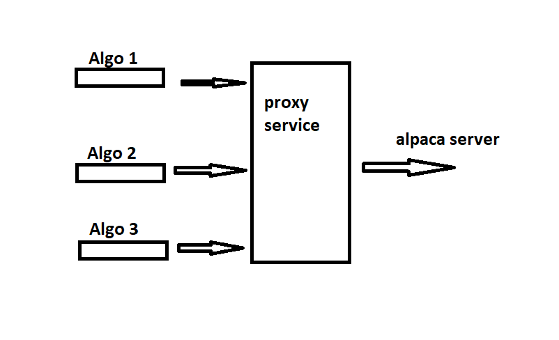

# alpaca-proxy-agent
This is a project to help users of [Alpaca](https://alpaca.markets) to execute more than one data websocket connections against their servers.

Right now you can only connect one websocket with your user credentials. if you want to run more than one algorithm, you can't. 
This project will help you achieve that. look at this illustration to get the concept

It doesn't matter which sdk you are using (python, js, go, c#) you can use this to achieve that.

## How to execute the docker container
You have 2 options:
- Using docker with image from docker hub (easiest)
- Cloning the repo and using docker/docker-compose to build and run this project locally(a bit more powerful if you want to edit the proxy code)

 
### Directly from docker hub
Nothing easier than that.
- Make sure you have docker installed
- Execute this command: `docker run -p 8765:8765 shlomik/alpaca-proxy-agent` 
note: You can change the port you're listening on just by doing this `-p xxxx:8765`
### Executing a local copy
- Clone the repo: `git clone https://github.com/shlomikushchi/alpaca-proxy-agent.git`
- Run this command locally: `docker-compose up` 
  It will build the image and run the container using docker-compose
note: If you want to execute in edit mode do this: `docker-compose -f dev.yml up`  
You could then update `main.py` and execute it locally.

## Selecting the data stream source
Alpaca supports 2 data streams:
* Alapca data stream
* Polygon data stream 

If you are using this project I assume you know what these are and what are the differences. 
The default data stream is Alpaca. To select the Polygon data stream you need to set an environment variable called `USE_POLYGON` like so: 
`docker run -p 8765:8765 -e USE_POLYGON=true shlomik/alpaca-proxy-agent` 

## Security
You are runngin a local websocket server. Make sure your IP is not accessible when you do (you probably shouldn't run this on public networks)
  
